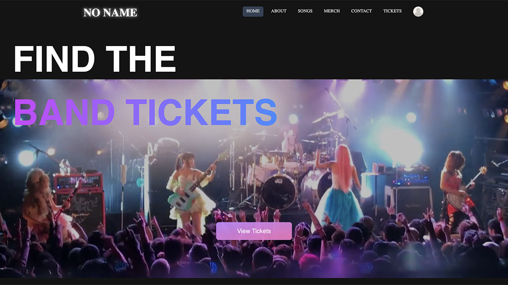
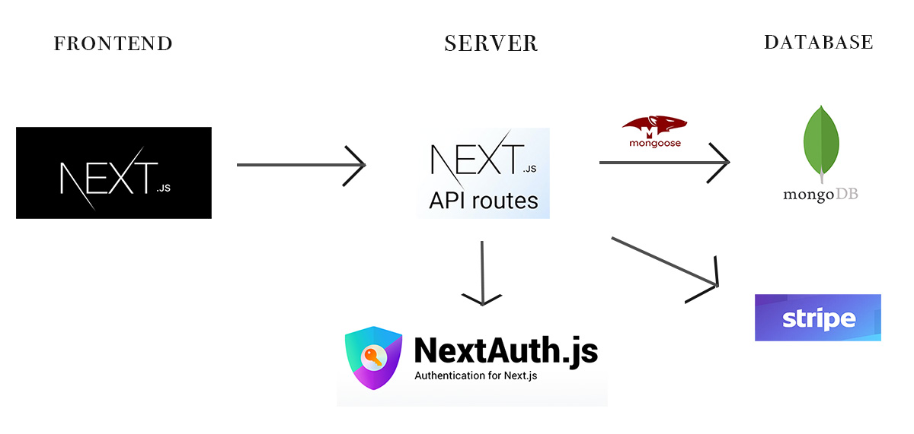
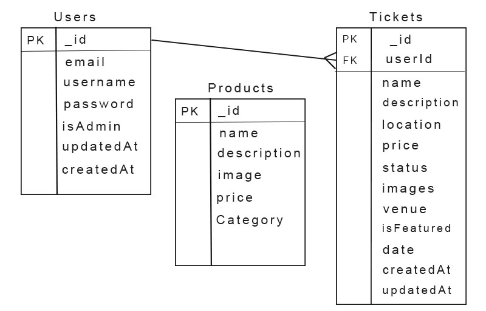

# Band Ticket Finder App

<!-- Image -->

[Website](https://band-ticket.vercel.app/)

## Description
This is a full-stack web application that allows users to search for tickets for their favorite bands. Users can also listen to music, purchase merchandise, and contact the band. The app is built with Next.js, Tailwind CSS, TypeScript, and MongoDB. It also uses NextAuth.js for authentication, Stripe for payment processing, and Leaflet for the dynamic map.

## Features
- Ticket search
- Login and Register 
- Google & GitHub Authentication & HttpOnly
- Music player
- Merchandise & Ticket purchase with Stripe
- Dynamic map for Ticket location (Leaflet)
- Contact forms
- Fully Responsive design

<!-- Image -->
## Architecture


<!-- Image -->
## Sitemap


<!-- Image -->
## ER


## Prerequisites
Before running this project, make sure you have Node.js installed on your system.

## Installation
```bash
npm install
```

## Running the project
```bash
npm run dev
```

## Languages & tools
- [Next.js](https://nextjs.org/)
- [NextAuth.js](https://next-auth.js.org/)
- [Tailwind CSS](https://tailwindcss.com/)
- [TypeScript](https://www.typescriptlang.org/)
- [React](https://reactjs.org/)
- [Node.js](https://nodejs.org/en/)
- [MongoDB](https://www.mongodb.com/)
- [Mongoose](https://mongoosejs.com/)
- [react-photo-gallery](https://www.npmjs.com/package/react-photo-gallery)
- [Stripe](https://stripe.com/)
- [Leaflet](https://leafletjs.com/)
- [Vercel](https://vercel.com/)

